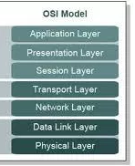
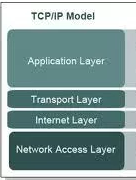

**Resume Pertemuan 1 Sistem Keamanan Jaringan**

  

**Latar Belakang Masalah**

1. **1.** Apa pengertian Osi layer?
2. **2.** Apa saja yang ada di OSI layer?
3. **3.** Apa fungsi dari tiap-tiap layer pada Osi layer beserta contoh-contoh nya?
4. **4.** Apa pengertian dari TCP/IP layer?
5. **5.** Apa fungsi dari tiap-tiap layer pada TCP/IP beserta contoh-contohnya?
6. **6.** Apa perbedaan dan persamaan antara TCP/IP dan OSI layer?

**ISI**

**OSI layer** adalah suatu model konseptual yang memiliki 7 layer yang berbeda dan memiliki fungsi berbeda pada tiap layernya.Berikut merupakan 7 layer yang terdapat pada Osi Layer:

1. Application layer berfungsi sebagai interface suatu aplikasi,pada layer inilah user berinteraksi dengan jaringan.contoh nya yaitu FTP,SMTP,HTTP,NFS,telnet.
2. Presentation layer betanggung jawab untuk mengkoversi dan memformat suatu data yang digunakan untuk transfer data.contoh nya yaitu network shell,virtual network computing dan remote dekstop protokol.
3. Session layer berfungsi untuk menjaga serta mengatur koneksi.contohnya NFS(network file system)
4. Transport layer berfungsi untuk memecah data menjadi paket-paket.

Contohnya TCP atau Connected Oriented)

1. Network Layer berfungsi untuk mendefinisikan alamat-alamat IP,contohnya Router.
2. Data Link layer berfungsi untuk mengelompokkan bit-bit data menjadi format yang dinamakan frame.contohnya bridge dan switch.
3. Physical layer berfungsi untuk menjaga transmisi jaringan dan mendefiniskan media.contoh Hub dan kabel fiber.

**TCP/IP** adalah model jaringan yang digunakan sebagai komunikasi data dalam proses tukar-menukar data/informasi.Berikut terdapat 4 layer dalam TCP/IP:

1. Aplication Layer berfungsi sebagai penyedia akses dan service-service kepada aplikasi terhadap layanan jaringan TCP/IP.Contoh HTTP,FTP dan SMPTP
2. Transport Layer berfungsi Sebagai penyedia service yang akan digunakan oleh application layer.Contoh TCP dan UDP.
3. Internet Layer berfungsi sebagai penyedia fungsi IP addressing dan routing.Contoh TCP/IP.
4. Network Access berfungsi untuk mendefinisikan protokol-protokol dan hardware-hardware dalam pengiriman data.Contoh LAN,PPP pada WAN.

Terdapat perbedaan antara TCP/IP dan OSI Layer yaitu pada OSI layer memiliki 7 buah layer sedangkan TCP/IP hanya memiliki 4 layer,kemudian TCP/IP mengombinasikan data link dan physical layers sedangkan OSI ke dalam satu layer.

Terdapat Persamaan antara TCP/IP dan OSI layer yaitu kedua-duanya sama-sama memiliki layer,kemudian juga keduanya sama-sama memiliki Application Layer walaupun memberikan layanan yang berbeda.

**PENUTUP**

Kesimpulan

Dengan adanya penjelasan-penjelasan diatas yaitu dapat disimpulkan bahwa pada TCP/IP dan OSI layer sama-sama memiliki layer tetapi memiliki beberapa perbedaan fungsi dan contoh pada tiap-tiap layernya.

Saran

Saran yang ingin saya sampaikan yaitu sebaiknya penjelasan mengenai TCP/IP dan ISO layer lebih kompleks lagi dalam penyampaian materinya agar mudah dipahami dan selalu mudah diingat.

link github: https://github.com/yandarizky/sistemkeamananjaringan

Nama : yanda rizky prasetiya

NPM : 1144004

Kelas : 3C

Prodi : D4 Teknik Informatika

Mata Kuliah : Sistem Keamanan Jaringan

link mata kuliah: www.awangga.net

referensi: https://panda94.wordpress.com/2013/01/21/layer-osi-dan-tcp-ip/

Scan plagiarisme: 

1. https://drive.google.com/open?id=0ByZqhNt9UFJ2cldEQzdxUG1lYTQ

2. https://drive.google.com/open?id=0ByZqhNt9UFJ2WTNyUHdyM0cwb0U