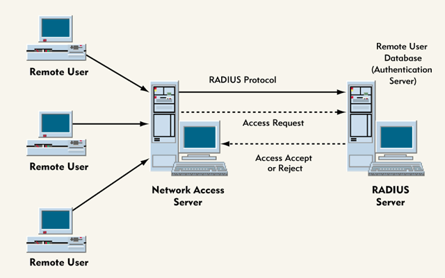

**RESUME PERTEMUAN 10 SISTEM KEAMANAN JARINGAN**

**Latar Belakang**

  

1. Apa yang dimaksud dengan RADIUS?
2. Apa fungsi dari RADIUS?
3. Bagaimana konsep dari RADIUS?
4. Bagaimana skema jaringan jika menggunakan RADIUS?

**ISI**

**Radius (Remote Authentication Dial-In User Service) merupakan** sebuah protocol keamanan komputer yang digunakan untuk melakukan autentikasi, otorisasi dan pendaftaran akun pengguna secara terpusat untuk mengakses jaringan

**Fungsi dari Radius sendiri membuat hak akses kepada wifi, jadi ketika kita ingin menggunakan jaringan wifi tersebut, kita harus login dengan username dan password yang telah terdaftar

**Konsep dari Radius itu sendiri terdiri dari AAA, yaitu:**

- Authentication Authentication adalah proses verifikasi user untuk memastikan adanya user yang memiliki hak akses biasanya memerikasi user dan password dan bisa lebih kompleks lagi
- Authorization Authorization adalah pemberian hak akses terhadap user yang sudah diverifikasi untuk mengakses ke jaringan
- Accounting Accounting adalah perhitungan jumlah bandwidth yang dipakai user

**Skema Jaringan RADIUS**

  

Penutup 

Kesimpulan 

Dari pernyataan diatas dapat disimpulkan bahwa RADIUS adalah suatu alat yang dapat digunakan untuk melakukan pemberian hak akses pada wifi kita agar jaringan kita lebih aman.

Saran 

Saran dari saya agar RADIUS ini dapat diimplementasikan agar hak akses wifi kita dapat digunakan oleh kita sendiri

link github: https://github.com/yandarizky/sistemkeamananjaringan

Nama : yanda rizky prasetiya

NPM : 1144004

Kelas : 3C

Prodi : D4 Teknik Informatika

Mata Kuliah : Sistem Keamanan Jaringan

link mata kuliah: www.awangga.net

referensi: http://putrajatim.blogspot.co.id/2012/08/remote-access-dial-in-user-service.html

Scan plagiarisme:

1. https://drive.google.com/open?id=0ByZqhNt9UFJ2OXROd1RQblRkaHM

2. https://drive.google.com/open?id=0ByZqhNt9UFJ2dEVIQUswVjJTbTg