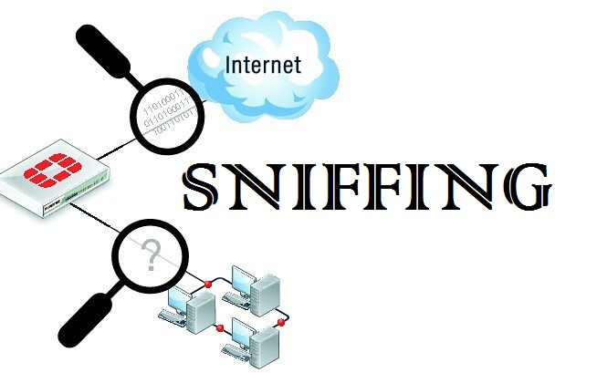

**LATAR BELAKANG MASALAH**

  

        Pada saat ini dunia hacking sudah marak digunakan dan bicara mengenai dunia hacking sudah banyak juga terdapat tools-tools pendukungnya yang digunakan dalam aktivitas hacking. Banyak istilah-istilah aktivitas hacking yang telah banyak di gunakan dan di implementsikan dalam dunia hacking.Salah satunya yaitu Sniffing.

1. Apa yang dimaksud Sniffing?
2. Apa saja bentuk-bentuk sniffing?
3. Apa kerugian yang terjadi akibat tindakan sniffing?
4. Bagaimana contoh implementasi dalam melakukan aktivitas sniffing?
5. Bagaimana cara mengantisipasi agar terhindar akibat dari proses sniffing?

**ISI**

**Sniffing adalah** suatu aktivitas penyadapan yang dilakukan dalam jaringan dengan tujuan untuk mencuri data-data pribadi dari account orang lain.

**Bentuk-bentuk sniffing** yaitu ada 2, **passive sniffing** yaitu aktivitas penyadapan yang dilakukan tanpa merubah isi data atau paket yang dikirimkan oleh jaringan, **active sniffing** yaitu aktivitas penyadapan yang dilakukan dengan merubah isi data atau paket.

**Kerugian yang terjadi akibat tindakan sniffing** yaitu terganggunya privacy user karena data-data pribadi user         dapat dengan mudah diketahui oleh pelaku kemudian Informasi penting dapat dicuri / hilang

**Contoh implementasi dalam melakukan aktivitas Sniffing** yaitu dalam mengambil username dan password dosen ketika login didalam sistem kampus yang ada. Pertama kita harus menggunakan satu jaringan dengan komputer atau laptop yang digunakan dosen dan kita atau bisa disebut kita terhubung dalam satu akses point, setelah sama – sama terhubung, kita buka program sniffer yang ada pada komputer atau laptop kita. Saat dosen melakukan login pada sistem, jalankan program sniffer pada laptop kita akan bekerja dan membaca username serta password yang dimasukkan oleh dosen yang sedang login pada form html dengan method post. Jika berhasil, maka kita bisa menggunakan username dan password yang digunakan dosen untuk login karena kita telah mendapatkan username dan password dosen yang sedang login menggunakan program sniffer atau proses sniffer yang kita jalankan.

**Cara mengantisipasi agar terhindar akibat dari proses sniffing** yaitu kita harus menambah sistem keamanan jaringan kita. Untuk meminimalisirnya dengan cara mengganti HTTP menjadi HTTPS karena dengan HTTPS dapat men-enkripsi data yang kita miliki dengan menggunakan AES atau yang lebih tinggi. Semakin tinggi enkripsi yang kita gunakan pada HTTPS maka semakin aman data yang kita miliki

**PENUTUP**

**Kesimpulan**

**       ** Dari penjelasan-penjelasan diatas dapat disimpulkan bahwa sniffing adalah suatu aktivitas penyadapan yang dilakukan dalam jaringan dengan tujuan untuk mencuri data-data pribadi dari account orang lain.Penggunaan sniffing dalam aktivitas hacking sangatlah mudah karena telah di sokong dengan tools-tools pendukungnya.

**Saran**

**       ** Saran dari saya yaitu agar dalam aktivitas hacking terutama pada sniffing ini agar di gunakan ke hal yang positif dan dengan sebaik-baiknya tanpa harus merugikan orang lain.

link github: https://github.com/yandarizky/sistemkeamananjaringan

Nama : yanda rizky prasetiya

NPM : 1144004

Kelas : 3C

Prodi : D4 Teknik Informatika

Mata Kuliah : Sistem Keamanan Jaringan

link mata kuliah: www.awangga.net

referensi: http://reckyjong.blogspot.co.id/2013/05/sniffing.html

Scan plagiarisme:

1. https://drive.google.com/open?id=0ByZqhNt9UFJ2dk9XQWxMMTBtcXc

2. https://drive.google.com/open?id=0ByZqhNt9UFJ2TFRQZkt3TV9VeDA