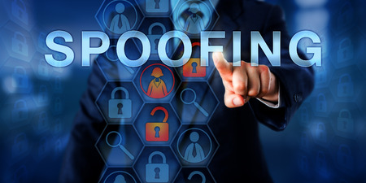

**RESUME PERTEMUAN 5 SISTEM KEAMANAN JARINGAN**

  

**Latar Belakang Masalah**

1. Apa yang dimaksud dengan spoofing?
2. Apa saja macam-macam spoofing?
3. Apa yang dimaksud ARP spoofing?
4. Bagaimana cara pencegahan spoofing?

**ISI**

**Spoofing adalah** suatuteknik yang digunakan untuk memperoleh akses yang tidak sah ke suatu komputer atau informasi, yang mana sang penyerang berpura-pura memalsukan bahwa mereka adalah host yang dapat dipercaya.

**Macam-macam spoofing** yaitu **IP spoofing** yaitu suatu teknik penyerangan yang rumit yang terdiri dari beberapa komponen, **DNS Spoofing** yaitu mengambil DNS dari sistem lain dengan membahayakan domain name server domain yang sah, **Identify spoofing** yaitu tindakan penyusupan dengan menggunakan identitas resmi yang ilegal.

**ARP Spoofing** adalah suatu konsep penyadapan terhadap dua mesin yang sedang berkomunikasi atau yang disebut dengan Man In The Middle Attack.

**Cara pencegahan spoofing yaitu** jangan mengaktifkan Javascript pada browser agar penyerang tidak dapat menyembunyikan bukti dari adanya penyerangan, mengimplementasikan authentifikasi dan enkripsi data, Memastikan bahwa location line dari browser selalu tampak.

**PENUTUP**

**Kesimpulan**

Kesimpulan dari penjelasan-penjelasan diatas yaitu Spoofing adalah **adalah** suatuteknik yang digunakan untuk memperoleh akses yang tidak sah ke suatu komputer atau informasi, yang mana sang penyerang berpura-pura memalsukan bahwa mereka adalah host yang dapat dipercaya,terdapat 3 macam spoofing yaitu ip spoofing,dns spoofing dan identify spoofing.

**Saran**

Saran yang saya berikan agar ilmu dan pelajaran yang diterima mengenai Spoofing ini dapat digunakan dengan baik dan benar dengan tidak merugikan orang lain.

link github: https://github.com/yandarizky/sistemkeamananjaringan

Nama : yanda rizky prasetiya

NPM : 1144004

Kelas : 3C

Prodi : D4 Teknik Informatika

Mata Kuliah : Sistem Keamanan Jaringan

link mata kuliah: www.awangga.net

referensi: http://54tr10.blogspot.co.id/2012/03/pengertian-spoofing.html

Scan plagiarisme:

1. https://drive.google.com/open?id=0ByZqhNt9UFJ2UW1oMnRRODdNSUk

2. https://drive.google.com/open?id=0ByZqhNt9UFJ2OG15ckdlSFh0OTg