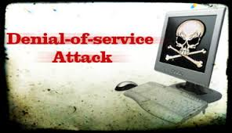

**RESUME PERTEMUAN 6 SISTEM KEAMANAN JARINGAN**

  

**Latar Belakang Masalah**

1. Apa yang dimaksud dengan Denial Of Service(DOS)?
2. Bagaimana cara kerja dari DOS?
3. Bagaimana cara melakukan pencegahan DOS?

**ISI**

**Denial Of Service(DOS) adalah** suatujenis serangan yang bertujuan untuk mencegah pengguna yang menikmati layanan yang diberikan server. Server adalah suatu unit yang berperan untuk melayani layanan yang diminta oleh client.

**Cara Kerja dari DOS yaitu** Dikarenakan server disini memberi layanan dari permintaan yang dikirim oleh client maka disini server memiliki kapasitas memberikan layanan untuk melayani permintaan client. Cara kerja dari DOS/DDOS ini sendiri membuat server sibuk melayani permintaan client, misalkan server memiliki batas maksimal jumlah yang bisa dilayani, maka penyerang membuat suatu sistem yang membuat penyerang memiliki banyak program berjalan yang mengirim permintaan kepada server sampai server tidak bisa melayani permintaan lagi atau kita sebut denied.

**Cara melakukan pencegahan DOS** untuk saat ini belum tersedia kita berada pada sistem client server.Namun ada cara untuk meringankan terhindar dari DOS/DDOSyaitu  Menaikan kapasitas layanan jika penyerang tidak menaikkan kapasitas permintaan, Memblok IP penyerang di firewall, Masukkan semua IP penyerang ke firewall dan Membuat Honey Pot.

**PENUTUP**

**Kesimpulan**

Denial Of Service(DOS) adalah suatu jenis serangan yang bertujuan untuk mencegah pengguna yang menikmati layanan yang diberikan server. Server adalah suatu unit yang berperan untuk melayani layanan yang diminta oleh client.

**Saran**

Kesimpulan dari penjelasan-penjelasan diatas yaitu agar kita harus segera mencari solusi pencegahan DOS yang belum tersedia ini agar dapat menghindari dari adanya serangan DOS/DDOS.

link github: https://github.com/yandarizky/sistemkeamananjaringan

Nama : yanda rizky prasetiya

NPM : 1144004

Kelas : 3C

Prodi : D4 Teknik Informatika

Mata Kuliah : Sistem Keamanan Jaringan

link mata kuliah: www.awangga.net

referensi: http://www.ilmuhacking.com/web-security/memahami-serangan-denial-of-service/

Scan plagiarisme:

1. https://drive.google.com/open?id=0ByZqhNt9UFJ2eHNzQjRhSUhnZm8

2. https://drive.google.com/open?id=0ByZqhNt9UFJ2UTJxaTczanhBN00