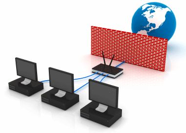

**Resume**  **Pertemuan 7 Sistem Keamanan Jaringan**

  

**Latar Belakang Masalah**

1. Jelaskan yang di maksud dengan firewall
2. Jelaskan maanfaat firewall
3. Jelaskan fungsi firewall
4. Jelaskan cara kerja firewall
5. Apa saja perangkat-perangkat firewall?

**ISI**

1. Firewall adalah  sebuah aturan dalam sebuah system operasi yang berfungsi untuk mengatur paket yang dating dan pergi dari suatu jaringan seperti layaknya pintu bisa dibuka dan ditutup.
2. Maanfaat firewall antara lain:

1. [Manfaat firewall](http://www.jaringankomputer.org/firewall-pengertian-fungsi-manfaat-dan-cara-kerja-firewall/)untuk menjaga informasi rahasia dan berharga yang menyelinap keluar tanpa sepengetahuan. sebagai filter juga digunakan untuk mencegah lalu lintas tertentu mengalir ke subnet jaringan.
2. untuk memodifikasi paket data yang datang di fire-wall. Proses ini disebut Network Address Translation (NAT).
3. Akurasi data seperti informasi keuangan, spesifikasi produk, harga produk dll, sangat penting bagi setiap perkembangan bisnis.

1. _Fungsi firewall_ sebagai pengontrol, mengawasi arus paket data yang mengalir di jaringan dan melakukan autentifikasi terhadap akses kejaringan.
2. Cara kerja dari firewall ini sendiri ada 2 yaitu dengan berdasarkan ip dan port.kemudian terdapat 3 kategori dalam firewall yaitu pass,drop dan block.

Pass yaitu membolehkan paket untuk lewat, drop yaitu melarang paket untuk lewat tetapi tidak memberi tahu pengirim bahwa paket tidak lewat,block yaitu melarang paket data untuk lewat tetapi memberi tahu pengirim bahwa paket nya dilarang untuk lewat.

1. Perangkat firewall terbagi menjadi 2 kategori yaitu hardware dan software, untuk hardware seperti mikrotik, cisco, fortiqure dal lain –lain. Sedangkan untuk software seperti bawaan OS : Windows Firewall, IPTables, OS khusus firewall : PFSense, hidrotik

**Penutup**

Kesimpulan

Firewall adalah  sebuah aturan dalam sebuah system operasi yang berfungsi untuk mengatur paket yang dating dan pergi dari suatu jaringan seperti layaknya pintu bisa dibuka dan ditutup..Firewall itu sendiri mempunyai fungsi dan manfaat yang terdapat didalamnya.

Saran
         Sebaiknya materi mengenai firewall ini dapat diperdalam lagi karena dapat berguna bagi kita dalam mengelola dan mengatur dalam hal jaringan.

link github: https://github.com/yandarizky/sistemkeamananjaringan

Nama : yanda rizky prasetiya

NPM : 1144004

Kelas : 3C

Prodi : D4 Teknik Informatika

Mata Kuliah : Sistem Keamanan Jaringan

link mata kuliah: www.awangga.net

referensi: https://keamanan-informasi.stei.itb.ac.id/category/firewall/

Scan plagiarisme:

1. https://drive.google.com/open?id=0ByZqhNt9UFJ2WVNMbzZwUGhrejA

2. https://drive.google.com/open?id=0ByZqhNt9UFJ2Zk9vWmhZZGpmcmc
