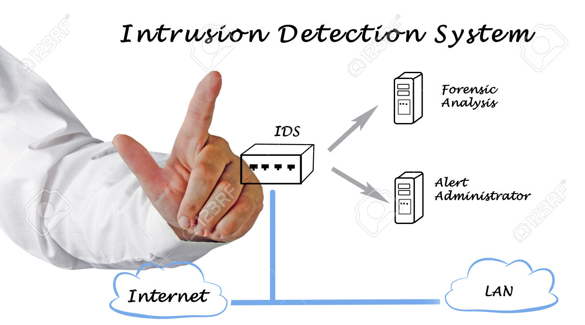

**RESUME PERTEMUAN 9 SISTEM KEAMANAN JARINGAN**

  

**LATAR BELAKANG MASALAH**

1. Apa yang dimaksud dengan Instrusion Detection System(IDS)?
2. Apa saja jenis-jenis IDS?
3. Apa perbedaan IDS dan IPS?
4. Bagaimana cara kerja IDS dan IDS?
5. Apa fungsi dari HIDS(Host Instrusion Detection System) dan NIDS(Network Intrusion Detection System)?

**ISI**

**Instrusion Detection System adalah** sebuah system yang berfungsi untuk melakukan pengawasan terhadap semua kegiatan yang mencurigakan dalam sebuah system dan juga melakukan pengawasan dalam lalu lintas jaringan/traffic jaringan.

**Jenis-jenis IDS yaitu** NIDS(Network Intrusion Detection system),HIDS(Host Instrusion Detection System), Signature Based,Anomaly Based,Passive IDS,Reactive IDS.

**Perbedaan IDS dan IPS adalah** Perbedaan antara IDS dan IPS terletak pada fungsinya, IDS berfungsi untuk membuat log/alert sedangkan IPS berfungsi untuk memblock.

**Cara kerja IDS dan IPS yaitu** jika IDS dating traffic tak biasa,kemudian IDS meneteksi traffic tersebut sam dengan rule yang didirikan lalu IDS membuat log alert bahwa ini sesuai dengan salah satu rule,sedangkan IPS yaitu memblock traffic tersebut.

**Fungsi HIDS yaitu** untuk memonitoring meta data dari berkas yang ada di komputer(localhost) sedangkan NIDS untuk memonitoring jaringan internet.

**PENUTUP**

**KESIMPULAN**

Dari penjelasan-penjelasan diatas dapat disimpulkan bahwa Instrusion Detection System adalah sebuah system yang berfungsi untuk melakukan pengawasan terhadap semua kegiatan yang mencurigakan dalam sebuah system dan juga melakukan pengawasan dalam lalu lintas jaringan/traffic jaringan.

**SARAN**

Saran yang dapat diberikan yaitu agar kedepannya lebih memperdalam lagi mengenai IDS agar kita dapat mengimplementasikan nya.

link github: https://github.com/yandarizky/sistemkeamananjaringan

Nama : yanda rizky prasetiya

NPM : 1144004

Kelas : 3C

Prodi : D4 Teknik Informatika

Mata Kuliah : Sistem Keamanan Jaringan

link mata kuliah: www.awangga.net

referensi: https://rahedy.wordpress.com/2010/06/10/apakah-itu-ids-intrution-detection-system/

Scan plagiarisme:

1. https://drive.google.com/open?id=0ByZqhNt9UFJ2SlBjcVBmcTcxWnM

2. https://drive.google.com/open?id=0ByZqhNt9UFJ2VWxVaG5OdXU3aXc
